# AI Claims Processing Platform

A production-style cloud-native claims processing platform built to explore modern software architecture using .NET, Azure, Domain-Driven Design (DDD), Event-Driven Architecture, and cloud deployment practices.
This repository contains a cloud-ready, event-driven claims processing platform built with .NET microservices, PostgreSQL, Azure Service Bus, and observability tooling. The solution is intended to support claim intake, document handling, fraud and payment checks, and notification workflows in a modular and extensible way.

## Technology Stack

- .NET 10
- ASP.NET Core
- PostgreSQL
- Azure Service Bus
- Azure Container Apps
- Azure Functions
- Docker & Docker Compose
- GitHub Actions
- OpenTelemetry
- Application Insights

## Architecture Diagram

```mermaid
flowchart LR
    Client[Client / API Consumer] --> Gateway[Gateway Service]
    Gateway --> Claims[Claims Service]
    Gateway --> Documents[Document Service]
    Gateway --> Notifications[Notification Service]
    Gateway --> Fraud[Fraud Service]
    Gateway --> Payments[Payment Service]

    Claims --> DB[(PostgreSQL)]
    Documents --> DB
    Notifications --> DB
    Claims --> Bus[Azure Service Bus]
    Documents --> Bus
    Fraud --> Bus
    Payments --> Bus
    Notifications --> Bus

    Documents --> Functions[Azure Functions]
    Functions --> Storage[(Blob Storage)]

    Claims --> Telemetry[OpenTelemetry / App Insights]
    Documents --> Telemetry
    Notifications --> Telemetry
    Fraud --> Telemetry
    Payments --> Telemetry
```

## What the platform does

- Orchestrates claim submission and downstream processing through a workflow-based saga model.
- Handles document upload and document processing with both Azure-backed and local/bridge-based paths.
- Separates concerns across dedicated services for claims, documents, notifications, fraud, payments, customer context, and API gateway responsibilities.
- Exposes health checks and telemetry so the platform can be monitored during local development and future cloud deployment.

## Deployment Platform

Rather than embedding deployment logic inside GitHub Actions, the repository includes a custom deployment platform responsible for deployment planning, impact analysis, dependency-aware execution, and Azure Container Apps deployment. GitHub Actions simply orchestrates the deployment process.

Current capabilities include:

- Manifest-driven deployments
- Impact analysis
- Dependency-aware execution planning
- Azure Container Apps deployment
- GitHub Actions integration

## Repository layout

- services/ – application services and their supporting layers
- building-blocks/ – shared contracts and integration building blocks
- infrastructure/ – Docker runtime assets, scripts, and documentation
- platform/deployment/ – deployment platform assets and console tooling
- serverless/document-processor-function/ – serverless document processing entry point

## Documentation

- Architecture review: [infrastructure/docs/ARCHITECTURE-REVIEW.md](infrastructure/docs/ARCHITECTURE-REVIEW.md)
- Workflow diagram: [infrastructure/docs/Workflow-diagram.md](infrastructure/docs/Workflow-diagram.md)
- Workspace structure: [infrastructure/docs/WORKSPACE-STRUCTURE.md](infrastructure/docs/WORKSPACE-STRUCTURE.md)
- Architecture decisions: [infrastructure/docs/ai_claims_platform_architecture_decisions.md](infrastructure/docs/ai_claims_platform_architecture_decisions.md)

## Getting started

1. Review the documentation above to understand the platform context and service boundaries.
2. Start the local stack from the Docker assets in [infrastructure/docker](infrastructure/docker).
3. Use the workspace solution files and deployment manifests as a starting point for local testing and future cloud deployment.

## Current implementation scope

- Core services in the workspace include claims, document, notification, fraud, payment, gateway, and customer service modules.
- Local development uses Docker Compose for runtime dependencies, migrations, and optional observability tools.
- The deployment layer includes deployment manifests, settings, and a deployment console project for Azure-oriented rollout preparation.
- Serverless document processing is available through the Azure Functions-based document processor project.

## Current Status

✅ Implemented

- Claims Service
- Document Service
- Fraud Service
- Payment Service
- Notification Service
- Deployment Platform
- GitHub Actions CI/CD
- Azure Container Apps Deployment
- OpenTelemetry

🚧 In Progress

- Customer Service
- Policy Service
- AI Integration
- Kubernetes

The platform is in an evolving implementation stage. Core service boundaries and messaging flows are in place, local runtime orchestration is available, and observability and deployment assets are being refined for a production-ready path.
