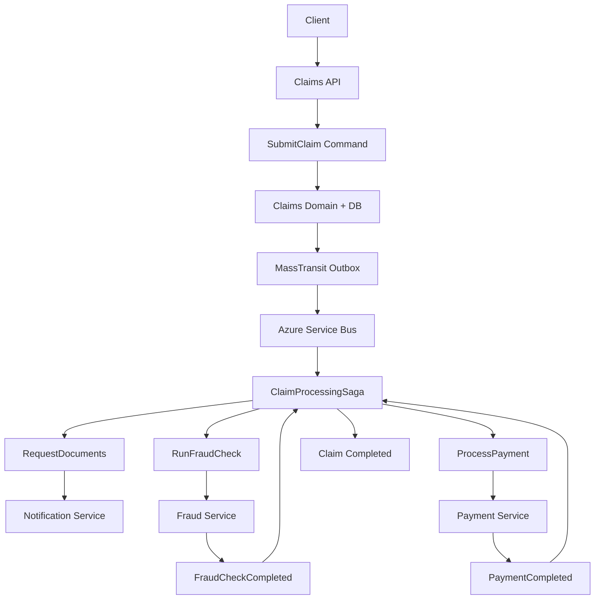
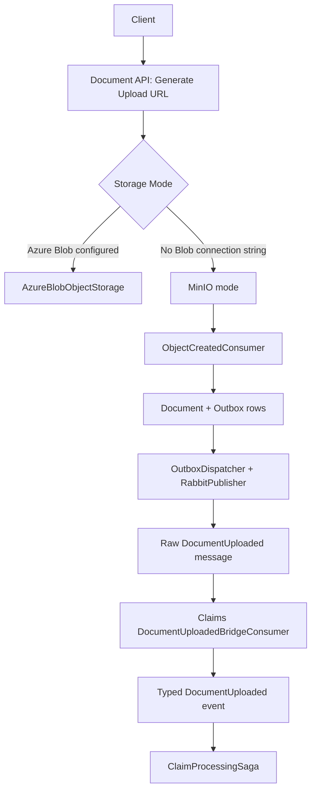

# Workflow Diagram

Generated: 2026-04-28

## Primary Workflow (Azure Service Bus)

## Document Side Path (Mode-Dependent)

## Observability Overlay Effect

- Base runtime: no OTLP endpoint injected.
- Observability overlay: sets `OTEL_EXPORTER_OTLP_ENDPOINT=http://jaeger:4317` and enables Seq/Jaeger/Prometheus/Grafana.